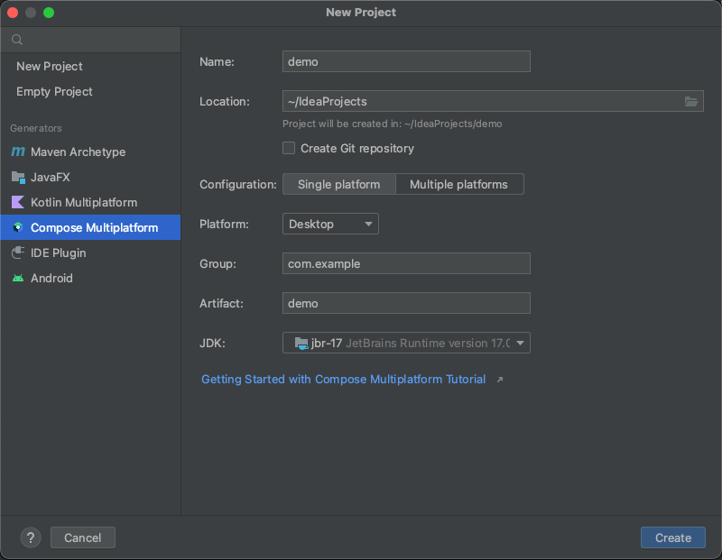

# TaRSyS Mobile Project Creator

Este proyecto es un ejemplo de lo que se puede realizar con [JetPackCompose para Escritorio](https://www.jetbrains.com/es-es/lp/compose-mpp/) (JetPackCompose4Desktop) 
y [Kotlin MultiPatform](https://kotlinlang.org/docs/multiplatform.html).

El proyecto nos permite, a partir de unos proyectos base (por ahora, soporta proyectos Android e iOS), crear un proyecto totalmente personalizado.
Los proyectos android que utilicemos como plantilla deben tener ciertas características (parámetros de configuración en su fichero):
- En el fichero **settings.gradle**, agregaremos una variable rootProject.name donde corresponda, este seré el nombre de proyecto.
- En el fichero ++build.gradle** agregaremos una variable en la sección ext llamada **base_package**, en la que estableceremos el package name de 
nuestra app.

## Descripción del proyecto

El proyecto está desarrollado utilizando [JetBrains IntelliJ Idea](https://www.jetbrains.com/es-es/idea/), versión community, el cual nos permite el
desarrollo completo de aplicaciones basadas en Kotlin MultiPlatform, eligiendo como tipo de proyecto "Compose Multiplatform"


La arquitectura elegida es totalmente lineal (no se ha definido una arquitectura, debido a la simplicidad del proyecto), aunque de forma ideal,
se debería implementar algún tipo de arquitectura. Aún así, la aplicación tiene varias particularidades:
- Los composables cuelgan de la carpeta composables en la cual los composables se organizan en base a funcionalidad.
  - editors, nos carga las distintas interfaces de usuario que nos permiten configurar los parámetros de los distintos tipos de proyecto.
  - external, contiene un composable FileChooserDialog (extraido de mi repo [mess_drawer](https://github.com/afalabarce/mess_drawer))
  - Composables.kt, alberga composables de propósito general.
  - MainComposables.kt, alberga los composables que permiten generar la UI principal de la app.
- Los modelos de datos se almacenan en una carpeta entities (no hay entidades de cache, remote o domain, técnicamente todo son entidades de dominio).
- Disponemos de varios enumerados, los cuales nos van a servir para el establecimiento de los distintos estados disponibles.
- Disponemos de diversas utilidades de propósito general, algunas extensiones a clases y tipos comunes, y un pequeño módulo
que permite la localización del proyecto.
- viewModels, en esta carpeta, si bien kotlin multiplatform no implementa los viewModel como tal, en este caso implementamos una clase con 
su correspondiente coroutineScope, que hará las veces de viewmodel.
- carpeta resources, se le ha dado un diseño similar a la carpeta de recursos de android.
- El fichero build.gradle está preparado para la creación de paquetes de instalación tanto para plataforma MacOS como Windows (dependiendo de
la plataforma de compilación se creará un tipo de paquete u otro). Como particularidad, hay que ser cuidadoso en la configuración del sistema
de compilación, ya que en algún caso (a mí me sucedió en mi Mac) hay que modificar **manualmente** la ruta de instalación del JDK.
```kotlin
compose.desktop {
    application {
        mainClass = "io.github.afalabarce.projectcreator.MainKt"
        fromFiles(project.fileTree("libs/") { include("**/*.jar") })

        nativeDistributions {
            targetFormats(TargetFormat.Dmg, TargetFormat.Msi, TargetFormat.Deb)
            packageName = "TaRSyS Mobile Project Creator"
            description = "Aplicación para crear Proyectos Mobile desde Proyectos Plantilla"
            packageVersion = "1.0.0"
            includeAllModules = true
            javaHome = "/Library/Java/JavaVirtualMachines/jdk-17.0.2.jdk"
            vendor = "Antonio Fdez. Alabarce"
            appResourcesRootDir.set(project.layout.projectDirectory.dir("resources"))
            windows {
                iconFile.set(project.file("src/jvmMain/resources/mipmap/ic_launcher.ico"))
                dirChooser = true
                //javaHome = "C:\\Program Files\\JetBrains\\IntelliJ IDEA Community Edition 2022.2.2\\jbr"
                menuGroup = "TaRSyS Mobile Project Creator"
            }

            macOS{
                packageBuildVersion = "1.0.0"
                bundleID = "io.github.afalabarce.projectcreator.MainKt"
                dockName = "TaRSyS Mobile Project Creator"
                javaHome = "/Library/Java/JavaVirtualMachines/jdk-17.0.2.jdk" // En MacOs, debemos establecerla manualmente, aunque parezca redundante.
                iconFile.set(project.file("src/jvmMain/resources/mipmap/ic_launcher.icns"))
                mainClass = "io.github.afalabarce.projectcreator.MainKt"
                appCategory = "public.app-category.developer-tools"
            }
        }
    }
}

```

## Funcionamiento de la aplicación

He publicado en [YouTube](https://www.youtube.com/watch?v=WEes5SARr0s) un video corto en el que se muestra el proceso de instalación, despliegue y 
utilización de la aplicación.

Como particularidad, la primera vez que se inicia, la aplicación crea en el directorio raíz del usuario una
carpeta llamada "", la cual, a su vez contiene una carpeta llamada "templates", dentro de la cual copiaremos
las carpetas con proyectos Android y/o iOS que deseemos utilizar como plantilla base.

## Conclusión

Espero que este proyecto pueda ser de utilidad, a la hora de generar proyectos de forma más eficiente, 
rebajando el tiempo invertido en la preparación inicial del proyecto, con muy pocas restricciones a la hora de preparar
las plantillas base (las desarrolladas por mí se adaptan a la perfección, [MVVMProject](https://github.com/afalabarce/MVVMProject) y [MVVMProject-Hilt](https://github.com/afalabarce/MVVMProject-Hilt)).

Es, además, un buen ejercicio para la introducción al desarrollo de aplicaciones de escritorio multiplataforma,
utilizando JetpackCompose y KMM.

Si crees que he hecho un buen trabajo y me merezco un café, puedes hacerme un [Paypal Me!](https://www.paypal.com/paypalme/afalabarce)